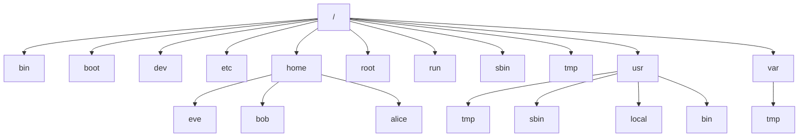

### Linux File System

* `/etc` (Extended Text Configuration files) => Holds system configuration files.
* `/mnt` (Mount) => Used to mount a file system temporarily
* `/boot` => Contains the Linux Kernel, boot support files and boot configuration files.
* `/home` => Designed to store user "home" directories and other user contents.
* `/opt` (Optional Dir) => Used to hold additional software that may need to be installed on the system.
* `/usr` (Unix System Resources dir)
  * `/usr/bin` => User Commands
  * `/usr/sbin` => System Admin Commands
  * `/usr/local` => Locally customized software
* `/var` (Variable dir) => Contains data that frequently changes while the system is operational.
  * `/var/logs` => Logs...
  * `/var/spool` => Print jobs, cron jobs, mail messages,...
  * `/var/tmp` => Temporary files that need to exists after reboot (MAX 30 days)
* `/tmp` => Temporary files (deleted after reboot)
* `/dev` => Stores device nodes for physical and virtual devices
* `/proc` (Process File System) => Maintains information about the current state of the running kernel
  * Includes details of CPU, RAM, Batterie,...
* `sys` (System File System) => Information about hardware devices, drivers and some kernel features is stored and maintained here.

---

### File Information

* `file` => Short information
  * Example : `file test.txt` 
* `stat` => Detailed information
  * Example : `stat test.txt`

---

### File Type

* `-` => Regular file
* `d` => Directory
* `l` => Link
* `c` => Special file or device file (keyboard, memory,...)
* `s` => socket
* `p` => Named pipe
* `b` => Block device