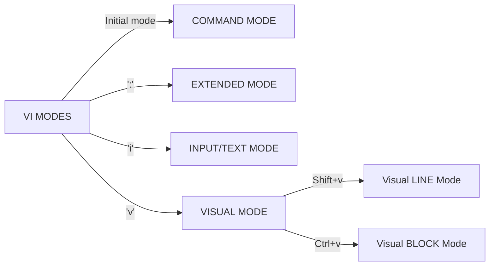

### VIM - VI



* Other commands :
  * `:%s/old/new` => Replace the **first occurrence** of "old" with "new"
  * `:%s/old/new/g` => Replaces **ALL occurrences** of "old" with "new"
  * `:wg` => Writes changes and then quits the program
  * `:q!` => Force quit (Without saving data)
* Examples :
  * Removes the first 3 lines
    * Visual mode ("v")
    * Visual Block mode ("Ctrl+v")
    * Select column and go down until all are selected then "x" to delete

---

### File Commands

* `touch -d 2023-01-25 file1` => Sets date on "file1"
* `touch -m file1` => Sets the modification time on "file1"
* `mkdir -p dir/dir1/dir15` => Creates a hierarchy of subdirectories
* `tac file1` => Displays file in reverse way (tac=opposite of cat)
* `less (file_name)` => Best tool to read files
  * `h` => Displays help
  * `/string` => Search Forward for "string"
  * `?string` => Search Backwards for "string"
  * `n` => Finds next occurrence of "string"
  * `N` => Finds previous occurrence of "string"
* `head -3 (file_name)` => Shows the FIRST 3 lines of file_name
* `tail -20 (file_name)` => Shows the LAST 20 lines of file_name
* `tail -f /var/log/messages` => "Follows" a log file (useful to see logs updated in "real time")

* `cp -r dir1 dir2` => Copies full dir1 to dir2
* `rm -r dir2°` => Removes dir2 and content

---

### Text Processors Commands

**Cut**

* `cut -c1 (file_name)` => List the first character
* `cut -c1-3 (file_name)` => List range of characters
* `cut -d: -f 6-7 (file_name)` => List first 6 and 7th column separated by ":"

**WC**

* `wc (file_name)` => Returns 85 284 2078 path/to/file (Lines/Words/Characters/Path)
  * `-l` => Prints number of lines
  * `-w` => Prints number of words
  * `-m` => Prints number of characters
  * `-c` => Prints number of bytes

**AWK**

* `awk '{print $1}' (file_name)` => List first field from a file
* `awk '/Jerry/ {print}' (file_name)` => Search for a specific word
* `awk -F: '{print $1}' (file_name)` => Output only first field of file, skip ":" delimiters
* `echo "Hello Tom" | awk '{$2="Adam"; print $0}'` => Replace words
* `ls -l | awk '{if($9 == "momo") print $0;}'` => If contains "momo" then print it

**Sed**

* Replace a string in a file with a newstring
  * `sed -i 's/Batman/Bob/g' (file_name)`
    * "g" for global (all occurence), remove "g" if only for a single word
    * PS : WORKS Without that "g"
    * "-i" = insert => Means replace in the file and not just on screen.
* Find and delete a line
  * `sed -i '/John/d' (file_name)` => Will delete all lines with has "John" in it.
* Remove empty lines
  * `sed -i '/^$/d' (file_name)`
* Remove the first or n lines in a file
  * `sed -i '1,2,3d' (file_name)`
  * Will remove line 1,2 and 3.
* To replace tabs with spaces
  * `sed -i 's/\t/ /g' (file_name)`
  * "\t" = tabs and " " = spaces
* Replace spaces with tabs
  * `sed -i 's/ /\t/g'`
* Show defined lines from a file
  * `sed -n 12,18p (file_name)` => Shows line 12 to 18
  * `sed 12,18d (file_name)` => Show all except line 12 to 18
* Replace a string while in VI
  * `:%s/Batman/John`

**Sort - uniq**

* `sort (file_name)` => Sorts file in alphabetical order
* `sort -r (file_name)` => sort in reverse order
* `sort -k2 (file_name)` => sort by field number (eg : k2=2nd column)
* `sort (file_name) | uniq` => Always sort first before using "uniq"
* `sort (file_name) | uniq -c` => Sort first, then "uniq" and list count
* `sort (file_name) | uniq -d` => Only show repeated lines

---

### Finding Files

* `find . -name file10` => Search for a file called "file10" in the "." directory.
* `find /dev -iname usb*` => Case insensitive that begins with "usb".
* `find /usr -size +40M` => Search for files larger than 40MB in size.
* `find /usr -maxdepth 2 -type d -none src` => Maximum 2 subdir below
* `find /var/log -mmin -100` => Search for files that have been modified in the past 100 minutes.
* **Advanced "find" commands** :
  * `find / -name core -type d -exec ls -ld {} \;`
    * Search for directories in the "/" by the name "core" and list them as they are discovered WITHOUT prompting for user confirmation ("-exec")
  * If wanted a prompt => Use "-ok" instead of "-exec"

---

### Archive tools and commands

* `gzip`
  * `gzip test` (creates a zip file "test.gz")
  * `gunzip test.gz` (unzips the file "test.gz")
* `bzip2` 
  * `bzip2 test` (creates a bzip2 file "test.bz2")
  * `bunzip2 test.bz2` (unzips the file 'test.bz2')
* `tar` (Tape Archive)
  * Options :
    * `-c` = Creates a tar file
    * `-v` = Verbose (gives more details)
    * `-f` = Output/input file name
    * `-x` = Extract file
    * `-t` = List files in tar
    * `-p` = Preserves Permissions
    * `-r` = add files to tar
    * `-j` = Bzip2
    * `-z` = Gzip
  * Examples :
    * `tar -cvf test.tar /home` => Creates a tar file "test.tar" with "/home" as content
    * `tar -xvf test.tar /file1` => Extracts files from test.tar
    * `tar -czvf test2.tar.gz /home` => Creates a gzip file with "/home" as content
    * `tar -xf test.tar.gz` => Extracts gzip archive

---

### Links

* `ln file1 file2` => Creates a hard link "file2" linked to "file1" (Points to SAME inode - same data)
* `ln -s file10 file20` => Creates soft link "file20" linked to "file10" (=A shortcut to "file10")
  * link size is the number of characters in the name
* `ls -li` => View inode number

---

### Input / Output / Error Redirection

* **stdin** (0) => Standard Input
* **stdout** (1) => Standard Output
* **stderr** (2) => Standard Error
* `&` => **stdout** + **stderr**
* `> file` => Redirect **stdout** to overwrite a file
* `>> file` => Redirect **stdout** to append to a file
* `2> file` => Redirect **stderr** to overwrite a file
* `2> /dev/null` => Send errors to VOID (nowhere)
* `&> file` => Redirect **stdout** and **stderr** to overwrite the SAME file
* `&>> file` => Redirect **stdout** and **stderr** to append the SAME file
* No clober
  * `set -o noclober` => Stops warning when overwriting files
  * `set +o noclober` => Unset previous command

---

### Pipelines

* A ***pipeline*** is a sequence of one or more commands separated by the ***pipe*** ("|"). A ***pipe*** connects the standard output of the first command to the standard input of the next command.

  * ```bash
    [user@host ~]$ ls | wc -l
    ```

* The ***tee*** command allows to write the output of the command (stdout) to a file AND to send it to the second pipe.

  * ```bash
    [user@host ~]$ ls -l | tee /tmp/saved-output | less
    ```

---

### Wildcard Characters

* `ls /etc/ma*` => All files that BEGINS with "ma"
* `ls -d .*` => All HIDDEN files
* `ls /var/log/*.log` => All files that END with ".log"
* `ls -d /var/log/????` => All files that have EXACTLY 4 characters
* `ls /usr/bin/[yw]*` => All files that begins with EITHER "y" or "w"
* `ls -d /etc/systemd/system/[m-o]*` => All files that begins with "m" until "o"
* `ls -d /etc/systemd/system/[!m-o]*` => All files except those between "m" and "o"

---

### Escape Characters

* `echo "$SHELL"` => Prints out "/bin/bash"
* `echo "\$PWD"` => Prints out "$PWD"
* `echo "'\'"` => Prints out `'\'`

---

### Grep and regex

* `grep -nv nologin /etc/passwd` => "-v" = Excludes lines with "nologin"
* `grep ^root /etc/passwd` => "^root" = Lines that starts (^) with "root"
* `grep bash$ /etc/passwd` => "bash$" = Lines that ENDS with ($) "bash"
* `grep -v ^$ /etc/login.defs` => "^$" = All empty lines and "-v" = Excludes
  * So Only shows lines that ARE NOT EMPTY
* `sudo grep -ve ^$ -ve ^# /etc/ssh/sshd_config`
  * `-ve ^$`= Excludes empty lines
  * `-ve ^#` = Excludes lines that start with "#"