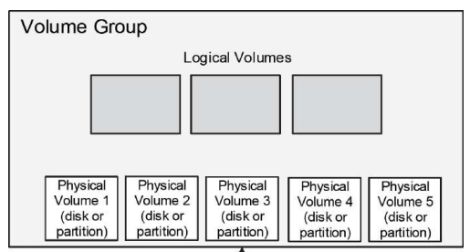
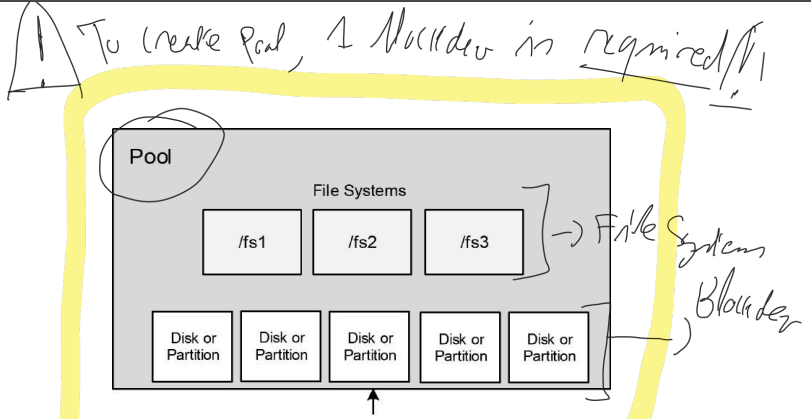

### Storage Management

At boot time, the OS reads a small region which is referred to as the Master Boot Record (MBR) on the BIOS-based systems and GUID (Globally Unique Identifiers) Partition Table (GPT) on the UEFI-based systems. Though MBR and GPT are designed for different PC firmware types, their job is essentially the same : to store disk partition information and the boot code.

### Disk Partitions

* `sda` => S for Sata, SAS or SCSI device; disk a.
* `lsblk` => List disk and view partition information
* `fdisk -l` => Other useful command (similar to lsblk)

### Storage Management Tools

* `parted`, `gdisk`, `vdo`, `lvm` and `stratis`.
* Parted is a simple tool that understands both MBR and GPT formats.
* Gdisk is designed to support the GPT format only.
* VDO is a disk optimizer software that takes advantage of certain technologies to minimize the overall data footprint on storage devices.
* LVM is a feature-rich logical volume management solution that gives flexibility in storage management.
* Stratis capitalizes on thin provisioning to create volumes much larger in size than the underlying storage devices they are built upon.

**Thin Provisioning**

* It allows for an economical allocation and utilization of storage space by moving arbitrary data blocks to contiguous locations, which results in empty block elimination.
* Supports VDO, LVM and Stratis.
* You can create a thin pool of storage space and assign volumes much larger storage space than the physical capacity of the pool.

---

### Parted

* parted = Partition (part) editor (ed)

* `parted print` => View partition inforation

* `parted mklabel` => Applies a label to the disk. Common labels are gpt and msdos.

* `parted mkpart` => Makes a new partition

* `parted name` => Assigns a name to a partition

* `parted rm` => Removes the specified partition

* > The ***/proc/partitions*** file is also updated when changes are made to partitions.

**Create an MBR Partition**

* In this exercice, you will assign partition type "msdos" to /dev/sdb fpr using it as an MBR disk. You will create and confirm a 100MB primary partition on the disk. And then, delete it.

* ```bash
  sudo parted /dev/sdb mklabel msdos # create lable "msdos"
  sudo parted /deb/sdb mkpart primary 1 101m # primary partition 1=>101MB
  cat /proc/partitions # or lsblk /dev/sdb or parted /deb/sdb
  
  sudo parted /dev/sdb rm 1 # remove partition 1 from disk /dev/sdb
  ```

---

### GPT and gdisk

* The `gdisk` (GPT disk) utility partitions disks using the GPT format.

* Commands can be shown by using "help" in the "fdisk" interaction.

  * c => Change a partition | d => delete a partition
  * n => add a new partition | o => Create a new empty partition table (GPT)
  * p => Print partition table | w => Write changes

* In this exercice, you will assign partition type "gpt" to /dev/sdc for using it as a GPT disk. You will create and confirm a 200MB partition on the disk. Then delete partition.

* ```bash
  sudo gdisk /dev/sdc # to view information about the partition
  GPT fdisk (gdisk) version 1.0.3
  Command (? for help): o # "o" will assign "gpt" as partition table
  Command (? for help): p # "p" =print partition table
  Command (? for help): n # create new partition
  Partition number (1-128, default 1):
  First sector (34-511966, default = 2048) or (+-)size(KMGTP):
  Last sector (2048-511966, default=511966) or (+-)size(KMGTP): +200M
  Hex code or GUID (L to show codes, Enter = 8300):
  
  Command (? for help): w # writes changes and confirm with "y"
  Do you want to procedd ? (Y/N): y
  
  Command (? for help): d1 # Delete partiton 1
  Command (? for help): w # apply changes
  Do you want to procedd ? (Y/N): y
  ```

---

### VDO - Virtual Data Optimizer

* Required package => `sudo dnf install vdo kmod-kvdo -y`

* Commands :

  * `vdostats` => Monitor usage statistics
  * `vdo create` => Adds anew VDO volume on the specified block device
  * `vdo status` => Returns the status and attributes of VDO volumes
  * `vdo list` => Lists the names of all started VDO volumes
  * `vdo start` => Starts a VDO volume
  * `vdo stop` => Stops a VDO volume

* In this exercice you will create a volume called "vdo-vol1" of logical size 16GB on /dev/sdf disk (**the actual size of /dev/sdf is 4GB**). You will list the volume and display its status information. You will also show the activation status of the compression and de-duplication features.

* ```bash
  sudo vdo create --name vdo-vol1 --device /dev/sdf --vdoLogics 1Size 16G --vdoSlabSize 120
  
  sudo vdo list # List new volume
  sudo vdostats --hu # Displays the usage status of the volume
  sudo vdo remove --name vdo-vol1 # delete the specified volume
  ```

* > The slab size is the size of the increment by which VDO volumes grow.

---

### LVM - Logical Volume Manager

* LVM accumulates spaces taken from partitions or entire disks (called Physical Volumes) to form a logical container (called Volume Group), which is then divided into logical partitions (called Logical Volumes).



* The LVM structure is made up of three key objects called physical volume, volume group and logical volume. These objects are further virtually broken down into Physical Extents (PEs) and Logical Extents (LEs).

* Commands

  * **Create partitions and prepare for LVM**
    * `sudo parted (/dev/DISK) mklabel (msdos/gpt)`
    * `sudo parted (/dev/DISK) mkpart primary 1 91 (for 92)`
    * `sudo parted (/dev/DISK) set (partition n°) lvm on`

  * **Physical Volume**
  	* `sudo pvcreate (PV_to_create)`
  	* `sudo pvremove (PV_to_remove)`

  * **Logical Volume**
	  * `sudo lvcreate -vL (LV_size) -n (LV_name) (VG_name)`
	  * `sudo lvextend -L (+ new_size) (/dev/VG_name/LV_name)`
	  * `sudo lvrename (VG_name) (LV_name) (LV_new_name)`
	  * `sudo lvreduce -L (+ new_size) (LV_name)`
	  * `sudo lvresize -L (+/-) (size_to_add_or_substract) (LV_name)`
	  * `sudo lvremove (/dev/VG_name/LV_name) -f`

  * **Volume Group**
	  * `sudo vgcreate -vs (PE Size) (VG_name) (PV to add)`
	  * `sudo vgextend (VG_name) (PV to add)`
	  * `sudo vgreduce (VG_name) (PV_to_add)`
	  * `sudo vgremove (VG_name)`

* **Create PV and VG**

  * In this exercise, you will **initialize one partition sdd1 (90MB)** and **one disk sde (250MB)** for use in LVM. You will **create a volume group called vgbook** and **add both physical volumes** to it. You will use the PE size of 16MB and list and display the volume group and the physical volumes.

  * ```bash
    sudo parted /dev/sdd mklabel msdos
    sudo parted /dev/sdd mkpart primary 1 91m
    sudo parted /dev/sdd set 1 lvm on # Add a "flag" of LVM to partition 1
    
    sudo pvcreate /dev/sdd1 /dev/sde -v # Adds partition and disk as PV
    
    sudo vgcreate -vs 16 vgbook /dev/sdd1 /dev/sde # Creates VG with 2 PV
    ```

* **Create LV**

  * In this exercise, you will **create two logical volumes, lvol0 and lvbook1**, in the vgbook volume group. You will use **120MB for lvol0** and **192MB for lvbook1** from the available pool of space.

  * ```bash
    sudo lvcreate -vL 120 vgbook # Creates a LV of 120MB in VG "vgbook"
    sudo lvcreate -vL 192 -n lvbook1 vgbook
    
    # "-L" = Logical Volume Size (default is MB)
    # "-n" = Specify name of LV

* **Extent a VG and a LV**

  * In this exercise, you will **add another partition sdd2 of size 158MB to vgbook** to increase the pool of allocatable space. You will initialize the new partition prior to adding it to the volume group. You will **increase the size of lvbook1 to 336MB**.

  * ```bash
    sudo parted /dev/sdd mkpart primary 92 250 # 1-91, 92-250
    sudo parted /dev/sdd set 2 lvm on
    
    sudo pvcreate /dev/sdd2
    sudo vgextend vgbook /dev/sdd2
    sudo lvextend -L +144 /dev/vgbook/lvbook1
    ```

* **Rename, Reduce, Extend and Remove Logical Volumes**

  * In this exercise, you will **rename lvol0 to lvbook2**. You will **decrease the size of lvbook2 to 50MB** using the lvreduce command and then **add 32MB** with the lvresize command. You will then **remove both logical volumes**.

  * ```bash
    sudo lvrename vgbook lvol0 lvbook2
    sudo lvreduce -L 50 lvbook2 # lvextend/lvreduce to SET to a value
    sudo lvresize -L +32 lvbook2 # lvresize to ADD/Substract a value
    sudo lvremove /dev/vgbook/lvbook1 -f
    sudo lvremove /dev/vgbook/lvbook2 -f
    ```

* **Reduce and Remove a VG**

  * In this exercise, you will **reduce vgbook by removing the sdd1 and sde physical volumes from it**, and then **remove the volume group**. **Confirm the deletion of the volume group and the logical volumes** at the end.

  * ```bash
    sudo vgreduce vgbook /dev/sdd1 /dev/sde # remove PV from VG
    sudo vgremove vgbook # Remove VG
    sudo vgs
    sudo lvs
    ```

* **Uninitialize Physical Volumes**

  * In this exercise, you will **uninitialize all three physical volumes—sdd1, sdd2, and sde** by deleting the LVM structural information from them. **Remove the partitions from the sdd disk**.

  * ```bash
    sudo pvremove /dev/sdd1 /dev/sdd2 /dev/sde
    sudo parted /dev/sdd rm 1 # remove partition 1
    sudo parted /dev/sdd rm 2 # remove partition 2
    ```

---

### Stratis

* The central idea surrounding the Stratis solution is a storage pool. A storage pool is created using at least one disk or partition, which is referred to as a blockdev.



* Stratis runs as a service, so its operational state can be managed with the ***systemctl*** command. For each pool added, Stratis creates a subdirectory under the /stratis directory matching the pool name. It then creates a symbolic link for each file system under that subdirectory to the actuel device file located in the /dev directory.

* Command

  * `stratis pool`
  * `stratis blockdev`
  * `stratis filesystem`

* **Create pool and filesystem**

  * In this exercise, you will create a Stratis pool called boookpool and a file system called bookfs in it. You will display information about the pool, file system, and device used. You will use the 1GB disk sdg for the pool. You will then mount the filesystem to a directory called bookfs1.

  * ```bash
    sudo stratis pool create bookpool /dev/sdg
    sudo stratis pool list # Display information about pool
    sudo stratis filesystem create bookpool bookfs
    sudo stratis filesystem list # Display information about filesystems
    sudo mkdir /bookfs1
    sudo mount /stratis/bookpool/bookfs /bookfs1
    ```

* **Expand and rename pool and file system**

  * In this exercise, you will expand the Stratis pool bookpool using the sdh disk. You will rename the pool to "rhcsapool" and the file system to "rhcsafs" it contains.

  * ```bash
    sudo stratis pool add-data bookpool /dev/sdh
    sudo stratis pool rename bookpool rhcsapool
    sudo stratis filesystem rename rhcsapool bookfs rhcsafs
    ```

* **Destroy file system and pool**

  * In this exercise, you will destroy the Stratis file system (rhcsafs) and the pool (rhcsapool). You will verify the deletion with appropriate commands.

  * ```bash
    sudo umount /bookfs1
    sudo stratis filesystem destroy rhcsapool rhcsafs
    sudo stratis pool destroy rhcsapool
    sudo stratis filesystem list
    sudo stratis pool list
    lsblk /dev/sdg /dev/sdh # Check that disk went back to original state
    ```

---

### File Systems and File System Types

* Disk-based file systems are typically created on physical drives using SATA, USB, Fibre Channel, and other technologies.
  * Ext4
  * XFS => **Default type for Stratis and RHEL8**
    * Does not run system file checks at system boot !
    * Must be done manually (`xfs_repair` utility)
    * CAN NOT SHRINK
* Network-based file systems are essentially disk-based file systems shared over the network for remote access.
  * NFS (Network File System)
  * AutoFS => NFS set to mount/umount automatically
* Memory-based file systems are virtual; they are created at system startup and destroyed when the system goes down.

### File System Administration Commands

* Create a file system :
  * `mkfs.ext4` or `mkfs.xfs` or `mkfs.vfat`
  * `mkfs -t ext4` or `mkfs -t xfs` or `mkfs -t vfat`

* Ext4
  * `e2label` => Modifies the label of a file system
  * `resize2fs` => Resizes a file system
  * `tune2fs` => Tunes or displays file system attributes
* XFS
  * `xfs_admin` => Tunes file system attributes
  * `xfs_growfs` => Extends the size of a file system
  * `xfs_info` => Exhibits information about a file system
* Other useful commands :
  * `blkid` / `lsblk`
  * `df -h` (disk free) / `du -h` (disk usage)
  * `mount` / `umount`

---

### Mount options - also for /etc/fstab file

* `acl` or `noacl` => Enables/disables the support for ACLs
* `auto` or `noauto` => Mounts (or not) the file system when the option is specified
* `default` => Mounts a file system with all the default value
* `_netdev` => Mount the file system when there's a network connectivity
* `remount` => Remounts an already mounted file system
* `ro` or `rw` => Mounts a file system read-only or read-write

File systems defined in the ***/etc/fstab*** file are mounted automatically at reboots.

* /dev/mapper/rhel-root	/	      xfs	defaults   0   0
* UUID=ciff334...                 /boot   xfs    defaults   0   0
  * (1) => Physical or virtual device path
  * (2) => Mount point for the file system
  * (3) => Type of file system
  * (4) => Mount options (defaults,_netdev,...)
  * (5) => Used by the "dump" utility to ascertain the file systems that need to be dumped. **NOT USED ON XFS.**
  * (6) => Expresses the sequence number in which to run the `e2fsck` (file system check and repair at system boot). **NOT USED ON XFS**.

---

### File system exercices

* **Create and Mount Ext4, VFAT and XFS File systems in partitions**

  * In this exercise, you will create **2 x 100MB partitions on the /dev/sdb disk**, **initialize them separately with the Ext4 and VFAT** file system types, define them for **persistence using their UUIDs**, **create mount points called /ext4fs1 and /vfatfs1**, **attach them to the directory structure**, and verify their availability and usage. Moreover, you will **use the disk /dev/sdc and repeat the above procedure to establish an XFS file system in it and mount it on /xfsfs1**.

  * ```bash
    sudo parted /dev/sdb mklabel msdos
    sudo parted /dev/sdb mkpart primary 1 101m
    sudo parted /dev/sdb mkpart 102 201m
    
    sudo mkfs -t ext4 /dev/sdb1
    sudo mkfs -t vfat /dev/sdb2
    sudo mkfs -t xfs /dev/sdc
    
    sudo vim /etc/fstab
    UUID="681hdyeg..."   /ext4fs1   ext4   defaults   0   0
    UUID="E4BBdkie..."   /vfatfs1   vfat   defaults   0   0
    UUID="jdheUyd3..."   /xfsfs1    xfs    defaults   0   0
    
    sudo mkdir /etc4fs1 /vfatfs1 /xfsfs1
    sudo mount -a # This mounts all file systems present in /etc/fstab
    ```

* **Create and Mount XFS File System in VDO Volume**

  * In this exercise, you will **create a VDO volume** called **vdo1** of **logical size 16GB** on the **sdf** disk (the actual size of this disks is 4GB). You will initialize the volume with the **XFS file system** type, define it for **persistence using its device files**, create a **mount point called /xfsvdo1**, **attach it to the directory structure**, and verify its availability and usage.

  * ```bash
    sudo vdo create --device /dev/sdf --name vdo1 --vdoSlabSize 128 --vdoLogicalSize 16G
    
    sudo mkfs -t xfs /dev/mapper/vdo1
    
    sudo nano /etc/fstab
    /dev/mapper/vdo1   /xfsvdo1   xfs   x-systemd.requires=vdo.service 0 0
    
    sudo mkdir /xfsvdo1
    sudo mount -a
    ```

* **Create and Mount Ext4 and XFS File System in LVM Logical Volumes**

  * In this exercise, you will **create a volume group called vgfs** comprised of a **160MB physical volume** created in a partition on the **/dev/sdd** disk. The **PE size** for the volume group should be set at **16MB**. You will **create two logical volumes called ext4vol and xfsvol of sizes 80MB** each and initialize them with the **Ext4 and XFS** file system types. You will ensure that both file systems are **persistently defined using their logical volume device filename**s. You will **create mount points called /ext4fs2 and /xfsfs2**, mount the file systems, and verify their availability and usage.

  * ```bash
    sudo parted /dev/sdd mkpart primary 1 161m
    sudo pvcreate /dev/sdd1
    sudo vgcreate -s 16 vgfs /dev/sdd1
    
    sudo lvcreate -n ext4vol -L 80 vgfs
    sudo lvcreate -n xfsvol -L 80 vgfs
    
    sudo mkfs -t ext4 /dev/vgfs/ext4vol
    sudo mkfs -t xfs /dev/vgfs/xfsvol
    
    sudo nano /etc/fstab
    /dev/vgfs/ext4vol   /ext4fs2   ext4   defaults   0   0
    /dev/vgfs/efsvol    /efsfs2    xfs    defaults   0   0
    
    sudo mkdir /etx4fs2 /xfsfs2
    sudo mount -a
    ```
  
* **Resize Ext4 and XFS File System in LVM Logical Volumes**

  * In this exercise, you will **grow the size of the vgfs volume group by adding the whole sde disk** to it. You will **extend the ext4vol logical volume** along with the file system it contains **by 40MB** using two separate commands. You will **extend the xfsvol logical volume** along with the file system it contains **by 40MB** using a single command. You will verify the new extensions.

  * ```bash
    sudo pvcreate /dev/sde
    sudo vgextend vgfs /dev/sde
    sudo lvresize -r -L +40 /dev/vgfs/ext4vol
    sudo lvresize -r -L +40 /dev/vgfs/xfsvol
    ```

* **Create, Mount and Expand XFS File System in Sratis Volume**

  * In this exercise, you will **create a Stratis pool called strpool** and a **file system (strfs2)** in it by reusing the **1GB sdg disk**. You will display information about the pool, file system, and device used. You will **expand the pool to include another 1GB disk sdh** and confirm.

  * ```bash
    sudo stratis pool create strpool1 /dev/sdg
    sudo stratis filesystem create strpool strfs2
    
    sudo nano /etc/fstab
    UUID="GDteh5..." /strfs2 xfs x-systemd.requires=stratisd.service 0 0
    
    sudo mkdir /strfs2
    sudo mount -a
    
    sudo stratis pool add-data strpool /dev/sdh
    ```

---

### Swap

* `free -ht` => To see available RAM

* `cat /proc/meminfo` => Also information in this file

* **Create and Activate Swap in Partition and Logical Volume**

  * In this exercise, you will create one **swap area in a new 40MB partition called sdb3** using the mkswap command. You will **create another swap area in a 140MB logical volume called swapvol in vgfs**. You will add their entries to the /etc/fstab file for **persistence**. You will use the **UUID and priority 1 for the partition swap** and the **device file and priority 2 for the logical volume swap**. You will **activate them** and use appropriate tools to validate the activation.

  * ```bash
    sudo parted /dev/sdb mkpart primary 202 242
    sudo lvcreate -L 144 -n swapvol vgfs
    sudo mkswap /dev/scb3
    sudo mkswap /dev/vgfs/swapvol
    
    sudo nano /etc/fstab
    UUID="jdjdufu3..." swap swap pri=1 0 0
    /dev/vgfs/swapvol  swap swap pri=2 0 0
    
    sudo swapon -a
    ```
